<div align="center">


<h1>Data Observability</h1>

<p><strong>The Enterprise Standard for Continuous Data Reliability, Quality Intelligence, and Pipeline Observability</strong></p>

[]()
[]()
[]()
[]()

<br/>

> **"You cannot trust the data you cannot observe."** 
> Data Observability is a flagship platform designed to provide production-ready monitoring for the modern data stack across Azure, AWS, GCP, and hybrid estates.

</div>

---

## 🏛️ Executive Summary

**Data Observability** is a flagship enterprise platform designed for Chief Data Officers (CDOs), Data Engineers, and SREs. In the era of data-driven decision making, "silent data failure"—where pipelines appear healthy but data is stale, missing, or corrupted—is the primary threat to business intelligence and AI accuracy.

This platform delivers a complete **Data Reliability Framework**, providing automated **Anomaly Detection**, **Freshness SLAs**, **Schema Drift Protection**, and **Lineage-Aware Impact Analysis**. It integrates natively with **Databricks**, **Snowflake**, **BigQuery**, and **Airflow**, ensuring that data engineers are the first to know when a reliability breach occurs, not the executive stakeholders.

---

## 💡 Why Data Observability Matters

As data estates scale, human-led quality checks become impossible.
- **Silent Failures**: Jobs finish successfully but deliver null values or duplicate records.
- **Schema Drift**: Upstream changes break downstream dashboards without warning.
- **Freshness Breaches**: Decisions are made based on 24-hour-old data instead of real-time insights.
- **Cost Inefficiency**: Orphaned datasets and inefficient queries bloat cloud budgets.

---

## 🚀 Business Outcomes

### 🎯 Strategic Reliability Impact
- **90% Faster MTTR**: Automated alerting and lineage mapping pinpoint the root cause in seconds.
- **Guaranteed Data Trust**: Executive-level reliability scorecards provide transparency for all datasets.
- **Optimized Cloud Spend**: Automated detection of cost anomalies and underutilized data assets.
- **Governance at Scale**: Automated schema and quality policy enforcement across multi-cloud environments.

---

## 🏗️ Technical Stack

| Layer | Technology | Rationale |
|---|---|---|
| **Monitoring Engine** | Python / FastAPI | High-performance API for telemetry collection and rules. |
| **Anomaly Detection** | scikit-learn / NumPy | Statistical models for volume and quality drift. |
| **Frontend** | React 18, Vite | Premium portal for reliability scorecards and incidents. |
| **Database** | PostgreSQL | Centralized repository for reliability state and metadata. |
| **Infrastructure** | Terraform | Multi-cloud IaC for observability foundations. |
| **Orchestration** | GitHub Actions | Automated CI/CD for reliability rules and platform updates. |

---

## 📐 Architecture Storytelling: 60+ Diagrams

### 1. Executive High-Level Architecture
The end-to-end reliability flow from ingestion to executive dashboard.

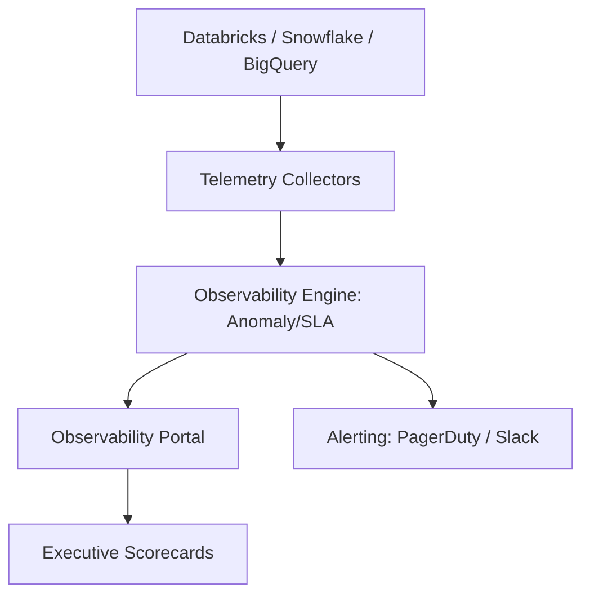

### 2. Detailed Component Topology
The internal service boundaries and telemetry ingestion paths.

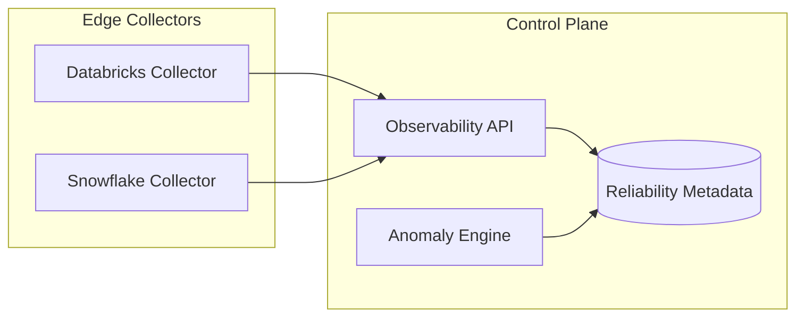

### 3. Frontend to Backend Request Path
Tracing a "View Incident Timeline" request through the platform.

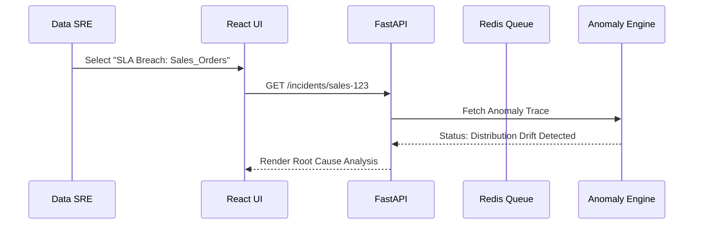

### 4. Metadata + Telemetry Control Plane
Managing the lifecycle of data reliability signals.

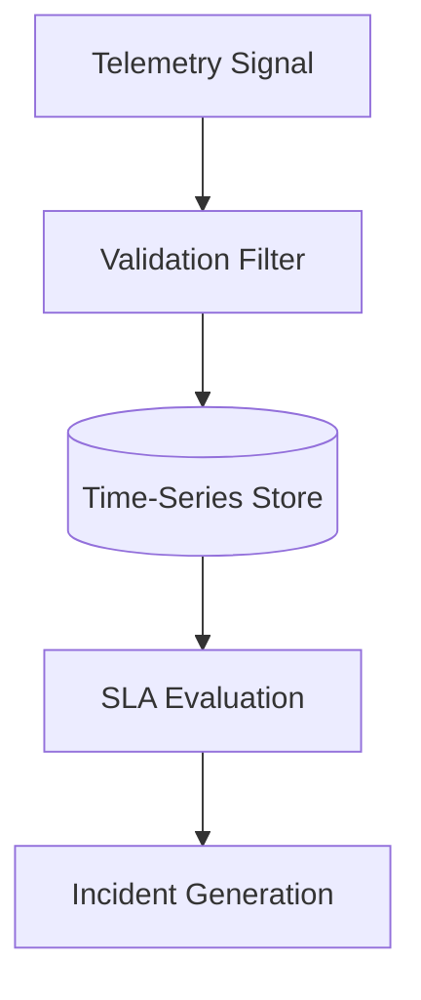

### 5. Multi-Cloud Data Platform Topology
Monitoring diverse data estates from a single pane of glass.

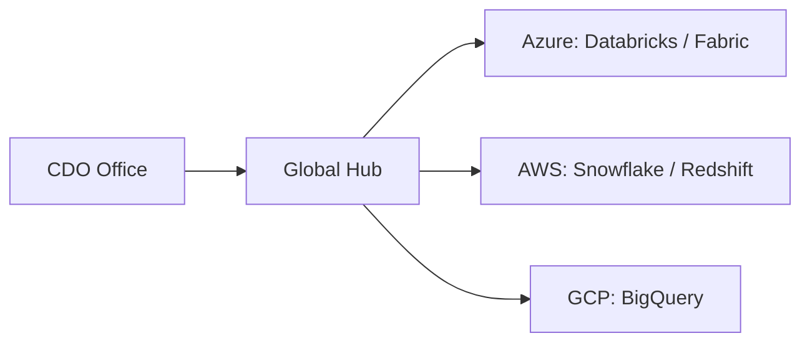

### 6. Regional Deployment Model
Hosting observability workers close to the data for performance.

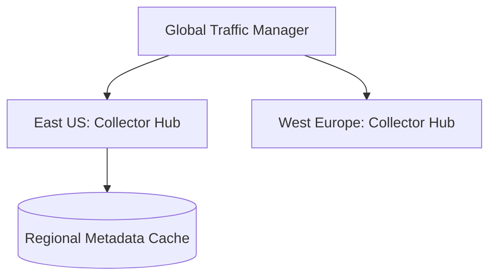

### 7. DR Failover Model
Ensuring reliability monitoring is itself highly reliable.

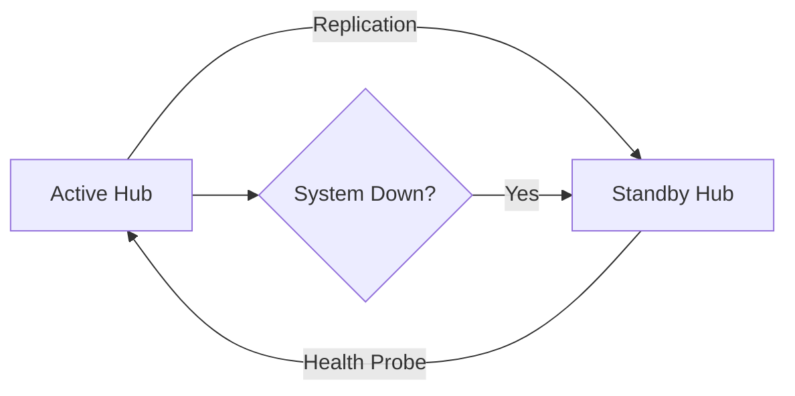

### 8. API Gateway Architecture
Securing and throttling telemetry ingestion.

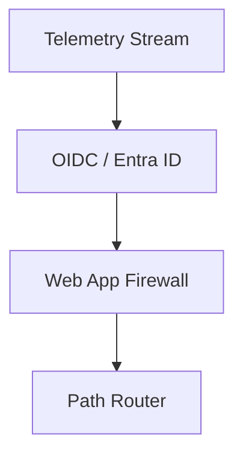

### 9. Queue Worker Architecture
Managing background anomaly detection and score calculation.

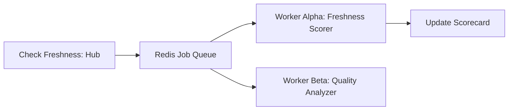

### 10. Dashboard Analytics Flow
How raw telemetry becomes executive reliability scorecards.

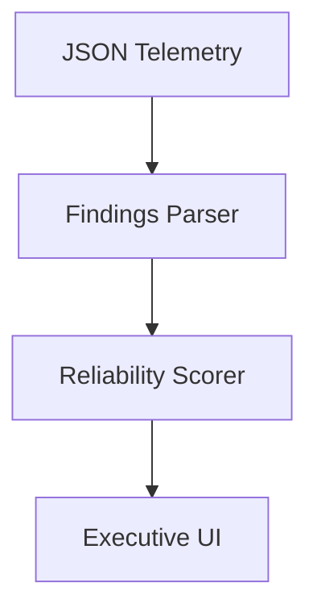

### 11. Pipeline Monitoring Lifecycle
Continuous health tracking of data movement.

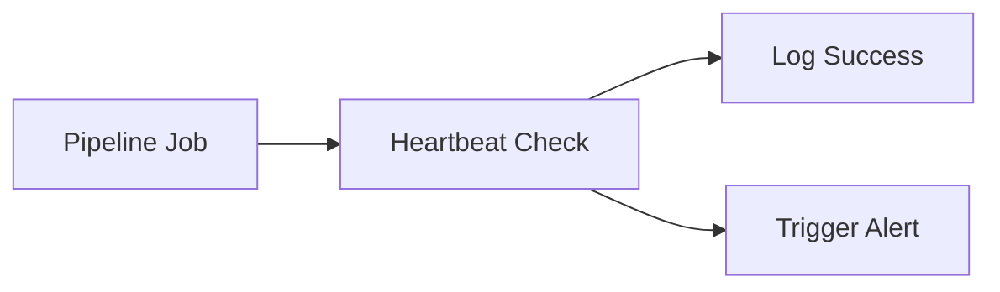

### 12. Freshness SLA Evaluation Flow
Validating data arrival against business expectations.

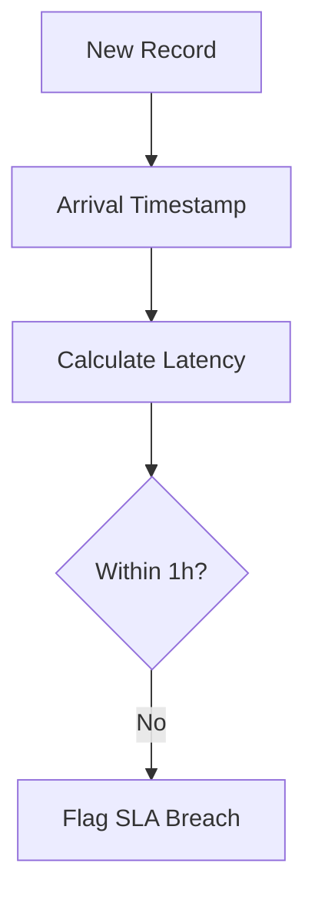

### 13. Data Quality Scoring Model
Quantifying the trust level of a dataset.

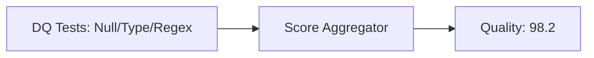

### 14. Null Spike Anomaly Detection
Identifying sudden loss of data integrity.

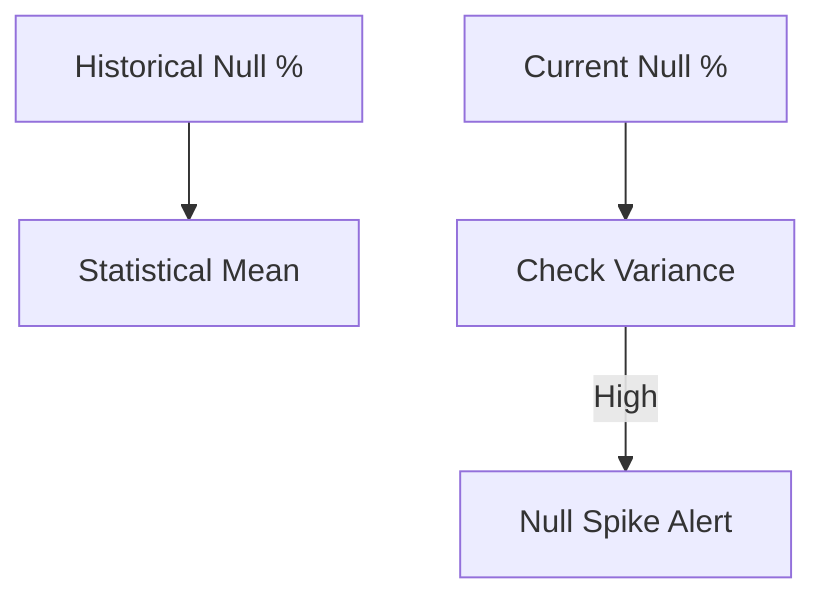

### 15. Row Count Variance Workflow
Detecting missing or duplicated data waves.

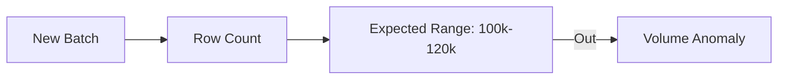

### 16. Distribution Drift Model
Monitoring changes in the statistical profile of data.

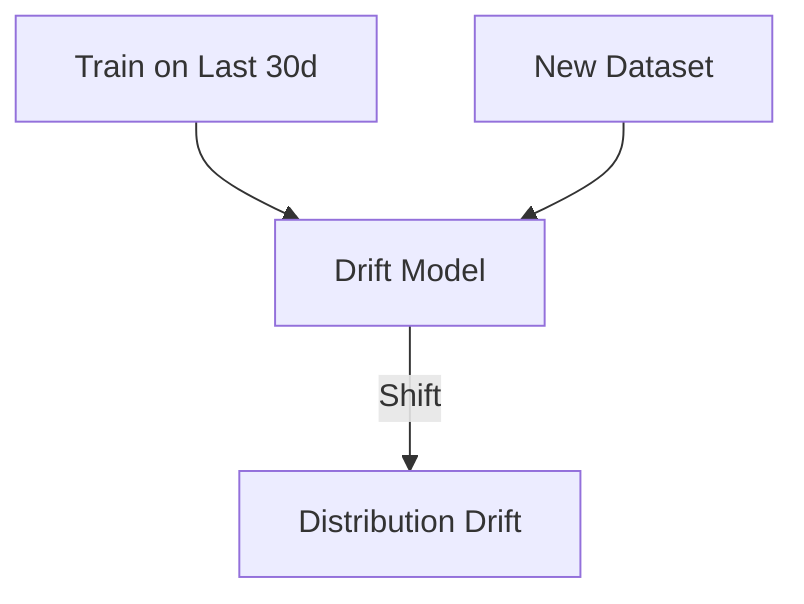

### 17. Schema Change Detection Flow
Protecting downstream consumers from breaking changes.

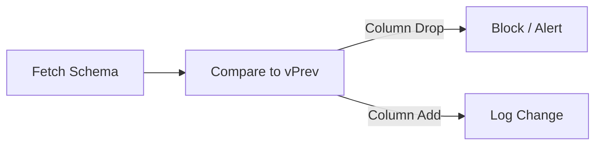

### 18. Lineage Impact Analysis
Understanding the blast radius of a data incident.

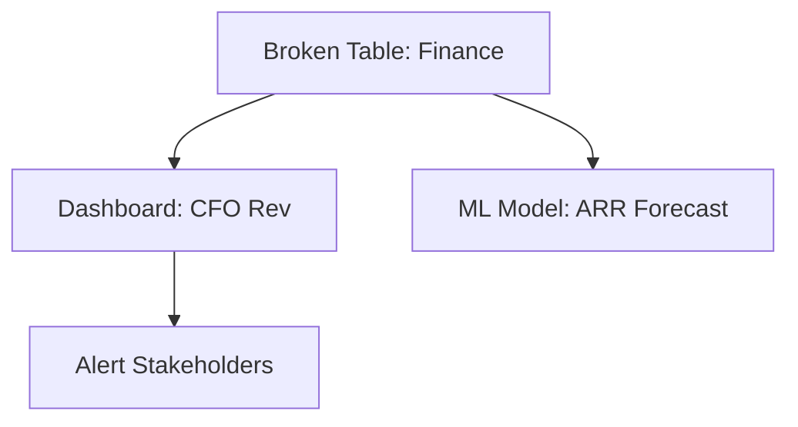

### 19. Incident Triage Workflow
Standardizing the response to reliability breaches.

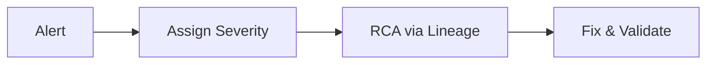

### 20. Auto-ticket creation model
Automating the feedback loop to engineering.

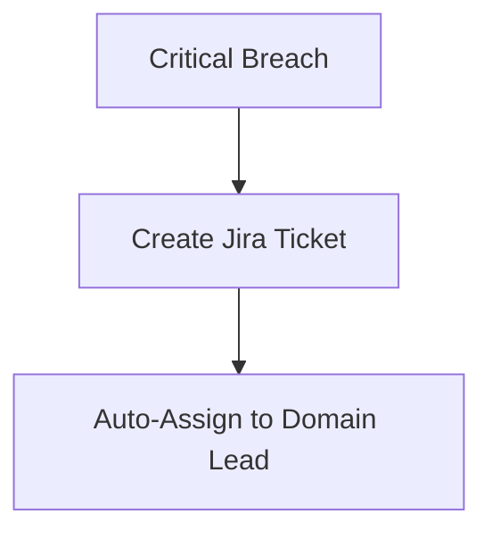

### 21. Databricks Telemetry Flow
Capturing job and table metrics from the lakehouse.

```mermaid
graph LR
    DBX[Unity Catalog] --> Collect[REST API Collector]
    Collect --> Metastore[Observability DB]
```

### 22. Snowflake Monitoring Model
Tracking warehouse usage and query performance.

```mermaid
graph TD
    SF[Information Schema] --> Poller[Metrics Poller]
    Poller --> Cost[Cost Analyzer]
```

### 23. Fabric Observability Flow
Monitoring Microsoft Fabric workspaces and items.

```mermaid
graph LR
    Fab[Fabric Workspace] --> Event[Eventstream]
    Event --> RealTime[Observability Hub]
```

### 24. BigQuery Monitoring Model
Google Cloud data observability integration.

```mermaid
graph TD
    BQ[Audit Logs] --> Sink[Pub/Sub]
    Sink --> Processor[Telemetry Engine]
```

### 25. Redshift Metrics Workflow
AWS data warehouse reliability tracking.

```mermaid
graph LR
    RS[STL/SVL Views] --> Agent[AWS Collector]
    Agent --> CloudWatch[Metrics]
```

### 26. Airflow DAG Monitoring Flow
Observing orchestration health and task latencies.

```mermaid
graph TD
    DAG[DAG Run] --> Callback[SLA Callback]
    Callback --> API[Observability API]
```

### 27. dbt Run Observability Model
Visualizing transformation quality from dbt Cloud/Core.

```mermaid
graph LR
    dbt[dbt test/run] --> Artifact[manifest.json]
    Artifact --> Parse[Reliability Parser]
```

### 28. Kafka Streaming Lag Model
Monitoring real-time data arrival delays.

```mermaid
graph TD
    Topic[Sales Topic] --> Lag[Consumer Lag: 50ms]
    Lag --> Threshold{>500ms?}
```

### 29. Spark Job Performance Workflow
Deep diving into distributed compute efficiency.

```mermaid
graph LR
    Stage[Spark Stage] --> Skew[Data Skew Check]
    Skew -->|Skewed| Advise[Repartition Advice]
```

### 30. Query Latency Benchmark Flow
Tracking performance drift of critical BI queries.

```mermaid
graph TD
    Query[Executive SQL] --> Bench[Baseline: 2s]
    New[New Execution] -->|8s| Alert[Performance Degraded]
```

### 31. Cost Anomaly Detection Model
Identifying runaway cloud data costs.

```mermaid
graph LR
    Bill[Hourly Billing] --> Anomaly[Cost Spike: +400%]
    Anomaly --> Owner[Notify Project Owner]
```

### 32. Chargeback Analytics Workflow
Allocating data costs to business units.

```mermaid
graph TD
    Cost[Shared Clusters] --> Tag[Domain Tagging]
    Tag --> Invoice[Departmental Chargeback]
```

### 33. User Adoption Heatmap Flow
Visualizing which datasets drive the most value.

```mermaid
graph LR
    Usage[Query Logs] --> Heatmap[Top Datasets]
    Heatmap --> CDO[Investment Planning]
```

### 34. Dashboard Usage Telemetry
Monitoring the health of the "Last Mile" of data.

```mermaid
graph TD
    PBI[PowerBI / Tableau] --> Activity[User Activity]
    Activity --> Impact[Popularity Score]
```

### 35. Dataset Popularity Ranking
Identifying "Gold" vs "Orphaned" data.

```mermaid
graph LR
    Queries[Query Count] --> Rank[Top 10 Tables]
```

### 36. Executive KPI Review Cycle
Measuring reliability ROI quarterly.

```mermaid
graph TD
    Stats[Metrics] --> Meeting[Quarterly Review]
```

### 37. Reliability Scorecard Workflow
Benchmarking dataset health for consumers.

```mermaid
graph LR
    Data[Dataset A] --> Score[Reliability: 99.4]
```

### 38. Capacity Forecast Model
Predicting future storage and compute needs.

```mermaid
graph TD
    Trend[Growth Trend] --> Predict[Capacity Full in 3m]
```

### 39. SLA Breach Escalation Flow
Ensuring visibility of unresolved data issues.

```mermaid
graph LR
    Breach[SLA Breach] -->|2h| Lead[Team Lead]
    Lead -->|24h| Director[Data Director]
```

### 40. Monthly Operating Review
Aligning platform teams with reliability goals.

```mermaid
graph TD
    Review[Monthly Review] --> Goals[Next Month OKRs]
```

### 41. OIDC / SSO Auth Flow
Securing access to the observability portal.

```mermaid
sequenceDiagram
    User->>Portal: Login
    Portal->>AzureAD: Auth
    AzureAD-->>User: Token
```

### 42. RBAC / ABAC Model
Zero-trust access to reliability metadata.

```mermaid
graph TD
    User[User] --> Role[Finance Analyst]
    Role --> Data[Finance Reliability]
```

### 43. Secrets Management Flow
Securing collector credentials.

```mermaid
graph LR
    Coll[Collector] --> KV[Key Vault / Secrets Mgr]
```

### 44. Audit Logging Architecture
Immutable records of all observability actions.

```mermaid
graph TD
    Admin[Admin Action] --> Audit[(Immutable Log)]
```

### 45. Privacy Masking Workflow
Protecting PII in telemetry data.

```mermaid
graph LR
    Tele[Telemetry JSON] --> Mask[Mask PII]
```

### 46. Retention Lifecycle
Managing the storage of historical metrics.

```mermaid
graph TD
    Old[Metrics > 1yr] --> Archive[Cold Storage]
```

### 47. Access Request Workflow
Governing requests to view sensitive incidents.

```mermaid
graph LR
    Req[View HR Incident] --> Appr[HR Data Owner]
```

### 48. Change Governance Model
Managing changes to reliability rules.

```mermaid
graph TD
    Rule[Change SLA] --> PeerReview[Pull Request]
```

### 49. Policy-as-Code Lifecycle
Continuous foundation compliance.

```mermaid
graph LR
    Policy[SLA > 99%] --> Check[GHA Check]
```

### 50. Risk Review Workflow
Assessing the impact of unmonitored data areas.

```mermaid
graph TD
    Gap[Unmonitored Source] --> Risk[Flag to CISO]
```

### 51. Metrics Pipeline
Real-time platform health monitoring.

```mermaid
graph LR
    Engine[Engine] --> Prom[Prometheus]
    Prom --> Grafana[Dashboard]
```

### 52. Logging Architecture
Centralized logging for distributed collectors.

```mermaid
graph TD
    ColA[Azure] --> Loki[Loki]
    ColB[AWS] --> Loki
```

### 53. Tracing Model
Tracing telemetry ingestion across services.

```mermaid
sequenceDiagram
    Portal->>API: Fetch Score
    API->>Engine: Calc Metrics
```

### 54. Alert Routing Workflow
Directing alerts to the right team instantly.

```mermaid
graph LR
    Anomaly[Sales Anomaly] --> Route[Sales Ops Team]
```

### 55. Pager Escalation Model
Ensuring critical incidents are acknowledged.

```mermaid
graph TD
    Alert[Critical] --> Pager[On-Call P1]
```

### 56. Release Pipeline Workflow
Continuous delivery of the observability platform.

```mermaid
graph LR
    Code[Code Push] --> GHA[Actions]
    GHA --> AKS[Deploy]
```

### 57. Canary Deployment Flow
Safely updating reliability rules.

```mermaid
graph TD
    Update[New Rule] --> Canary[Test on 5% Data]
```

### 58. Chaos Testing Workflow
Validating monitoring resilience.

```mermaid
graph LR
    Chaos[Kill Collector] --> Detect[Alert Still Fires]
```

### 59. Recovery Validation Model
Verifying data is clean after an incident fix.

```mermaid
graph TD
    Fix[Fix Applied] --> ReCheck[Full Quality Scan]
```

### 60. Continuous Improvement Loop
Refining models based on false positives.

```mermaid
graph LR
    Alert[False Positive] --> Feedback[Model Retrain]
```

---

## 🔬 Data Reliability Methodology

### 1. The Six Dimensions of Data Quality
Our platform evaluates every dataset against:
- **Completeness**: Are there missing records or null spikes?
- **Freshness**: Did the data arrive within the SLA?
- **Accuracy**: Does the data match the physical reality?
- **Consistency**: Is the data uniform across different systems?
- **Validity**: Does the data conform to defined formats/schemas?
- **Uniqueness**: Are there unexpected duplicate records?

### 2. Anomaly Detection Engine
We leverage statistical process control and machine learning to distinguish between "normal variance" (e.g., lower sales on weekends) and "genuine anomalies" (e.g., ingestion failure). Our engine automatically builds dynamic thresholds for every monitored metric, reducing alert fatigue.

---

## 🚦 Getting Started

### 1. Prerequisites
- **Terraform** (v1.5+).
- **Docker Desktop**.
- **Azure/AWS/GCP CLI** configured.

### 2. Local Setup
```bash
# Clone the repository
git clone https://github.com/Devopstrio/data-observability.git
cd data-observability

# Start the Observability Control Plane
docker-compose up --build
```
Access the Reliability Portal at `http://localhost:3000`.

---

## 🛡️ Governance & Security
- **Privacy by Design**: All telemetry data is stripped of PII before storage.
- **Immutable Auditability**: Every change to a reliability rule or an incident status is recorded in an immutable audit log.
- **Zero-Trust Access**: Access to the observability control plane is governed by enterprise OIDC and granular RBAC.

---
<sub>&copy; 2026 Devopstrio &mdash; Engineering the Future of Data Trust.</sub>
