<div align="center">


<h1>Data Observability</h1>

<p><strong>The Institutional-Grade Platform for Standardized Data Trust Foundations, Quality Governance, and Multi-Cloud Observability Ecosystems.</strong></p>

[]()
[]()
[]()

<br/>

> **"Industrializing data telemetry to automate trust foundations."** 
> **Data Observability** is an enterprise-grade platform designed to provide a secure, measurable, and highly automated foundation for global data trust operations. It orchestrates the complex lifecycle of data observability—from pipeline telemetry integration and quality metrics calculation to lineage analysis and unified trust auditing.

</div>

---

## 🏛️ Executive Summary

Fragmented data pipelines and manual quality checks are strategic operational liabilities; lack of centralized data observability is a primary barrier to organizational engineering maturity. Organizations fail to maintain a high-performing data culture not because of a lack of data, but because of fragmented measurement standards, lack of automated anomaly identification, and an inability to orchestrate observability planes with operational precision.

This platform provides the **Data Intelligence Plane**. It implements a complete **Data-Observability-as-Code Framework**, enabling Data Leaders and Platform teams to manage global data trust foundations as first-class citizens. By automating the identification of delivery bottlenecks through real-time telemetry analysis and orchestrating the provisioning of secure performance-driven validation policies, we ensure that every organizational team—from core data engineers to product analytics squads—is supported by default, audited for history, and strictly aligned with institutional trust frameworks (OpenLineage, Great Expectations).

---

## 📐 Architecture Storytelling: Principal Reference Models

### 1. Principal Architecture: Global Data Observability & Data Intelligence Plane
This diagram illustrates the end-to-end flow from pipeline telemetry ingestion and multi-cloud orchestration to quality enforcement, performance validation, and institutional data auditing.

```mermaid
graph LR
    %% Subgraph Definitions
    subgraph TelemetryIngress["Pipeline & Pipeline Ingress"]
        direction TB
        Sources["Databases / Streams / Files"]
        Ingest["Kafka / Event Hub / CDC"]
        ETL["Spark / Airflow / DBT"]
    end

    subgraph IntelligenceEngine["Data Intelligence Hub"]
        direction TB
        API["FastAPI Analytics Gateway"]
        AnalyticsOrchestrator["Global Trust & Quality Hub"]
        Governance_Hub["Privacy & Compliance Guardrail Hub"]
        AIOps_Validator["Drift & Anomaly Analysis Hub"]
    end

    subgraph OperationsPlane["Distributed Analytics Ecosystem"]
        direction TB
        ManagedLakes["Managed Standardized Metrics Lakes"]
        ActivePipelines["Managed Automated Flow Pipelines"]
        ReportingSinks["Managed Infrastructure Delivery Hubs"]
    end

    subgraph OperationsHub["Institutional Data Hub"]
        direction TB
        Scorecard["Data Maturity Scorecard"]
        Analytics["Data Flow & Trust Velocity Stats"]
        Audit["Forensic Trust Metadata Lake"]
    end

    subgraph DevOps["Data-Observability-as-Code Framework"]
        direction TB
        TF["Terraform Analytics Modules"]
        DriftBot["Productivity & Config Drift Validator"]
        ChatOps["Measurement Operations Hub"]
    end

    %% Flow Arrows
    TelemetryIngress -->|1. Submit Telemetry| API
    API -->|2. Orchestrate Analytics| AnalyticsOrchestrator
    AnalyticsOrchestrator -->|3. Apply Privacy Guard| Governance_Hub
    Governance_Hub -->|4. Assess Drift| AIOps_Validator
    
    AIOps_Validator -->|5. Execute Calculation| OperationsPlane
    OperationsPlane -->|6. Notify Status| ChatOps
    API -->|7. Visualize Health| Scorecard
    
    Scorecard -->|8. Track Maturity| Analytics
    Scorecard -->|9. Record Performance| Audit
    
    TF -->|10. Provision Backbone| IntelligenceEngine
    DriftBot -->|11. Inject Friction Risk| AnalyticsOrchestrator
    Audit -->|12. Improve Operations| ManagedLakes

    %% Styling
    classDef ingress fill:#f5f5f5,stroke:#616161,stroke-width:2px;
    classDef intel fill:#e8eaf6,stroke:#1a237e,stroke-width:2px;
    classDef operations fill:#e1f5fe,stroke:#01579b,stroke-width:2px;
    classDef ops fill:#ede7f6,stroke:#311b92,stroke-width:2px;
    classDef devops fill:#e8f5e9,stroke:#1b5e20,stroke-width:2px;

    class TelemetryIngress ingress;
    class IntelligenceEngine intel;
    class OperationsPlane operations;
    class OperationsHub ops;
    class DevOps devops;
```

### 2. The Data Observability Lifecycle Flow
The continuous path of a data observability platform from initial integration (pipeline) and aggregation (metrics) to active analysis (anomaly), optimization (trust), and institutional forensic auditing (scorecard).

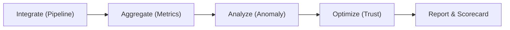

### 3. Distributed Data Telemetry Topology
Strategically orchestrating standardized analytics across global data hubs, diverse lakehouses, and multi-cloud platforms, providing a unified institutional view of global data health and operational readiness.

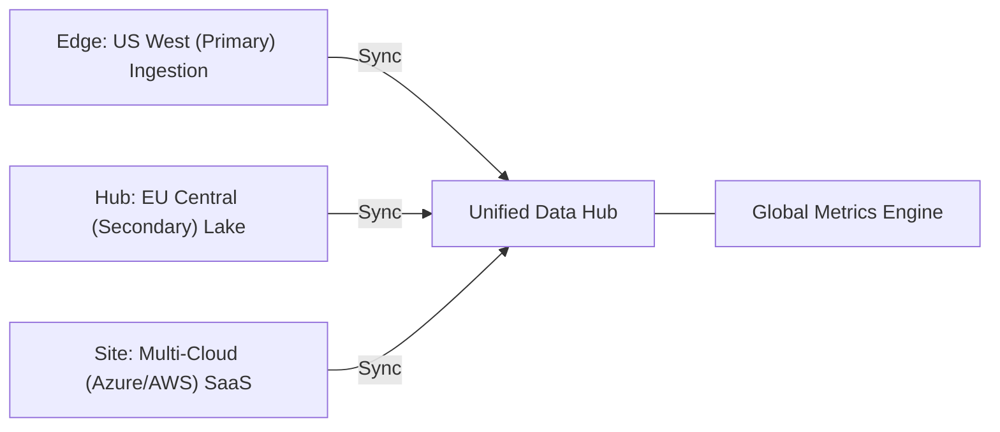

### 4. Data Governance & High-Trust Data Plane Protection Flow
Executing complex logic for securing the bridge between data pipelines and executive dashboards, ensuring every organizational identity is verified, team-level privacy is maintained, and every telemetry access is according to institutional standards.

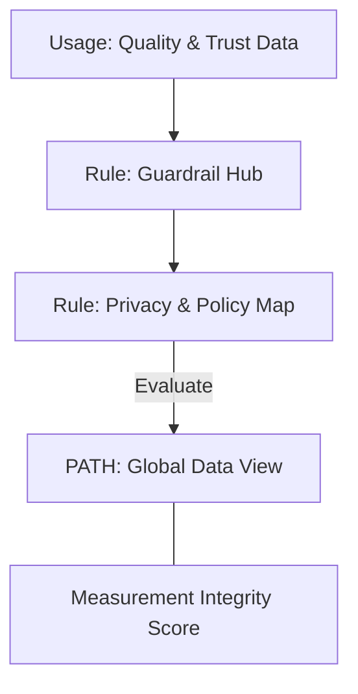

### 5. Multi-Region Data Federation & Governance Flow
Automatically managing unified data observability standards across global regions and diverse business units, ensuring institutional data residency and privacy boundaries by default.

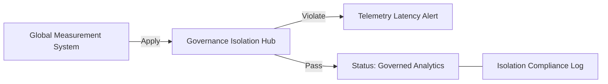

### 6. Encryption & Perimeter Protection Flow (Data Standard)
Managing the lifecycle of an analytics request, automatically enforcing institutional TLS 1.3 and resource encryption standards as required by security policy, ensuring zero-latency security confidence.

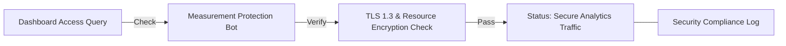

### 7. Institutional Data Observability Maturity Scorecard
Grading organizational performance based on key indicators: Data Quality Index, Pipeline Reliability Index, and Trust Adoption Scores.

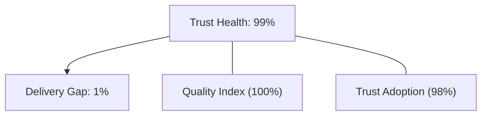

### 8. Identity & RBAC for Data Governance
Managing fine-grained access to analytics hubs, provisioning workers, and audit logs between CDOs, Data Engineering Managers, and Data Stewards.

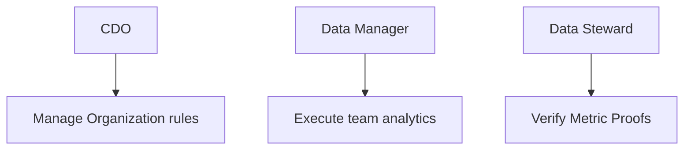

### 9. IaC Deployment: Data-Observability-as-Code Framework
Using modular Terraform to deploy and manage the versioned distribution of the analytics tracking hubs, policy protection workers, and forensic metadata lakes.

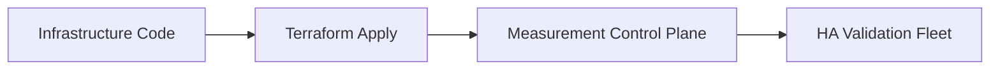

### 10. AIOps Data Drift & Risk Validation Flow
Using advanced analytics to identify sudden surges in data volume, unauthorized schema changes, suspicious configuration drifts, or unusual delivery pattern changes that could result in institutional risk or data corruption.

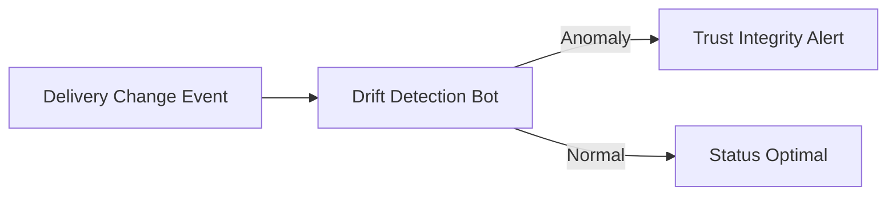

### 11. Metadata Lake for Forensic Data Audit
Storing long-term records of every pipeline integration event (metadata), every validation executed, and every lineage history for institutional record-keeping, compliance auditing, and post-provisioning forensics.

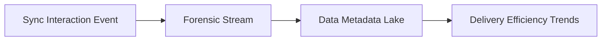

---

## 🏛️ Core Governance Pillars

1.  **Unified Foundation Coordination**: Maximizing trust by centralizing all data measurement through a single institutional plane.
2.  **Automated Analytics Provisioning**: Eliminating "manual quality checks" scenarios through proactive orchestration and pattern verification.
3.  **Sequential Flow Intelligence**: Ensuring zero-interruption operations through dependency-aware telemetry-driven data engineering.
4.  **Zero-Trust Privacy Protection**: Automatically enforcing identity-based access, team-level aggregation, and privacy evaluation across all analytics tiers.
5.  **Autonomous Operations Logic**: Guaranteeing reliability through automated industry-specific effectiveness monitoring runbooks.
6.  **Full Measurement Auditability**: Immutable recording of every metric change and analytics provision for institutional forensics.

---

## 🛠️ Technical Stack & Implementation

### Analytics Engine & APIs
*   **Framework**: Python 3.11+ / FastAPI.
*   **Performance Engine**: Custom Python-based logic for multi-toolchain telemetry ingestion and trust metrics.
*   **Integrations**: Native connectors for Spark, Airflow, dbt, and OpenTelemetry.
*   **Persistence**: PostgreSQL (Data Ledger) and Redis (Live Flow State).
*   **Auth Orchestrator**: Federated OIDC/SAML for least-privilege analytics management access.

### Governance Dashboard (UI)
*   **Framework**: React 18 / Vite.
*   **Theme**: Dark, Slate, Indigo (Modern high-fidelity productivity aesthetic).
*   **Visualization**: D3.js for delivery topologies and Recharts for readiness velocity analytics.

### Infrastructure & DevOps
*   **Runtime**: AWS EKS or Azure Kubernetes Service (AKS) for management plane.
*   **Measurement Hub**: Managed event sourcing for immutable trust timeline reconstruction.
*   **IaC**: Modular Terraform for deploying the analytics landing zone and validation fleet.

---

## 🏗️ IaC Mapping (Module Structure)

| Module | Purpose | Real Services |
| :--- | :--- | :--- |
| **`infrastructure/measurement_hub`** | Central management plane | EKS, PostgreSQL, Redis |
| **`infrastructure/collectors`** | Distributed telemetry workers | Azure, AWS, GCP APIs |
| **`infrastructure/ingestion_pipes`** | Telemetry Ingestion Hubs | Webhooks, Lambda |
| **`infrastructure/auditing`** | Forensic effectiveness sinks | S3, Athena, Quicksight |

---

## 🚀 Deployment Guide

### Local Principal Environment
```bash
# Clone the Data Observability repository
git clone https://github.com/devopstrio/data-observability.git
cd data-observability

# Configure environment
cp .env.example .env

# Launch the Analytics stack
make init

# Trigger a mock telemetry update and automated guardrail validation simulation
make simulate-observability
```

Access the Management Portal at `http://localhost:3000`.

---

## 📜 License
Distributed under the MIT License. See `LICENSE` for more information.

---
<div align="center">
  <p>© 2026 Devopstrio. All rights reserved.</p>
</div>
